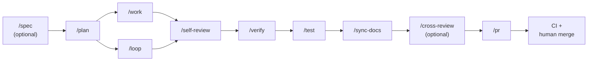

<div align="center">

# ralph

**Claude Code + Codex CLI harness engineering.**

Scaffold, upgrade, and run opinionated agent harnesses that work with both Claude Code and the OpenAI Codex CLI from the same project — small always-on maps, on-demand skills, deterministic hooks, evidence-backed reviews, and optional autonomous parallel execution (Ralph Loop).

[](https://github.com/yoshpy-dev/ralph/actions/workflows/verify.yml)
[](https://github.com/yoshpy-dev/ralph/releases/latest)
[](go.mod)
[](LICENSE)
[](#install)
[](https://github.com/yoshpy-dev/ralph/releases)

[Why ralph?](#why-ralph) &middot; [Install](#install) &middot; [Quick start](#quick-start) &middot; [Features](#features) &middot; [Commands](#commands) &middot; [Operating loop](#operating-loop) &middot; [Ralph Loop](#ralph-loop-autonomous-parallel-execution) &middot; [Language packs](#language-packs) &middot; [Portability](#portability)

</div>

## Why ralph?

Claude Code gives you a powerful agent, but the default setup is a blank slate. Repo-level harness conventions — rules, skills, hooks, subagents, verification scripts — have to be invented, maintained, and upgraded by hand, and they drift fast across projects.

`ralph` ships those conventions as a distributable, upgradable scaffold.

| | Bare Claude Code | `ralph init` |
|---|:---:|:---:|
| Always-on map (`AGENTS.md` / `CLAUDE.md`) | — | ✓ |
| On-demand skills (plan, work, verify, loop, ...) | manual | 10+ bundled |
| Deterministic hooks (mojibake guard, commit-msg, bash guard, ...) | manual | pre-wired |
| Evidence-backed pipeline (self-review → verify → test → sync-docs) | ad hoc | canonical order, enforced |
| Autonomous parallel execution | — | Ralph Loop (multi-worktree) |
| Language packs (TS, Python, Rust, Go, Dart) | — | opt-in |
| Drift management between projects | manual copy | `ralph upgrade` |
| Cross-agent portability | — | portable `AGENTS.md` + scripts |

## Install

```sh
# Homebrew
brew install yoshpy-dev/tap/ralph

# Or install script (verifies SHA256 against GitHub Releases)
curl -fsSL https://raw.githubusercontent.com/yoshpy-dev/ralph/main/scripts/install.sh | sh
```

Verify:

```sh
ralph version
ralph doctor
```

## Quick start

```sh
ralph init my-project
cd my-project
ralph doctor                  # environment check (Claude + Codex)
```

Both CLIs are wired up automatically. To make Codex's project-level config and
hooks actually load, run `codex trust .` once after `ralph init`. `ralph doctor`
flags trust gaps so you do not lose hooks silently.

Create your first plan and run the loop inside Claude Code:

```sh
# Standard flow
./scripts/new-feature-plan.sh login-form

# Ralph Loop (directory-based plan with parallel slices)
./scripts/new-ralph-plan.sh login-form N/A 3
```

In Claude Code, follow the loop with slash commands:

```
/spec (optional) → /plan → /work (or /loop)
→ /self-review → /verify → /test → /sync-docs
→ /cross-review (optional) → /pr
```

In Codex, the same flow runs via skill mention syntax (`/spec` collides with
Codex built-in slash commands — use `$skill-name` or the `/skills` menu):

```
$spec (optional) → $plan → $work (or $loop)
→ $self-review → $verify → $test → $sync-docs
→ $cross-review (optional) → $pr
```

Before claiming a task is done:

```sh
./scripts/run-verify.sh
```

## Features

| | |
|:---|:---|
| **Maps, not manuals**<br/>Short `AGENTS.md` / `CLAUDE.md`; push detail into rules and skills, promote repeats into hooks. | **Canonical pipeline**<br/>`self-review → verify → test → sync-docs → cross-review → pr` enforced in standard flow and Ralph Loop. |
| **Deterministic hooks**<br/>Mojibake guard, commit-msg secret scan, Bash guardrails, verification reminders — pre-wired in `settings.json`. | **Ralph Loop**<br/>Multi-worktree autonomous parallel slices, integration branch, unified PR — orchestrated by `ralph run`. |
| **Language packs**<br/>TypeScript, Python, Rust, Go, Dart starters (opt-in) with per-language `verify.sh` and path-scoped rules. | **Drift-proof upgrades**<br/>Hash-based `ralph upgrade` with per-file conflict resolution — keeps N projects aligned as the scaffold evolves. |
| **Evidence over prose**<br/>Every review, verify, test, and codex pass produces a dated artifact in `docs/reports/`. | **Cross-agent portable**<br/>`AGENTS.md` + `scripts/` + `packs/` stay neutral; `.claude/` is the Claude-native layer you can stack others beside. |

## Commands

| Command | Purpose |
|---------|---------|
| `ralph init [name]` | Scaffold a new project (interactive: language packs, Ralph Loop, TUI). |
| `ralph upgrade` | Pull template updates with per-file conflict resolution. |
| `ralph run` | Execute a Ralph Loop pipeline (orchestrator + per-slice pipelines). |
| `ralph status` | Launch TUI (Lazygit-style 4-pane) or fall back to table/JSON output. |
| `ralph retry <slice>` | Retry a failed or stuck slice. |
| `ralph abort [--slice <name>]` | Abort a single slice or all slices. |
| `ralph pack add <lang>` | Install a language pack. |
| `ralph doctor` | Check Claude Code CLI, hooks, manifest drift, language packs. |
| `ralph version` | Show semver + commit + build date. |

Run `ralph help <command>` for flags.

### `ralph upgrade` interactive diff

When `ralph upgrade` detects local edits, it prompts `[o]verwrite / [s]kip / [d]iff ?`. Choosing `d` renders a line-numbered unified diff: each change line carries a right-aligned `<old> <new> │ <prefix><content>` gutter, hunk headers read `@@ 旧 L<start>–<end>  →  新 L<start>–<end> @@`, and `-` / `+` are colorized (red / green; `---` / `+++` bold; `@@` cyan) when stdout is a terminal. Set `NO_COLOR=1` (or any non-empty value, per [no-color.org](https://no-color.org)) to suppress ANSI escapes; piping or redirecting also disables them automatically.

## What `ralph init` scaffolds

The philosophy: **a map, not a manual**. Keep `AGENTS.md` small, push detail into rules and skills, promote repeated mistakes into hooks, scripts, tests, or CI.

<details>
<summary>Scaffold tree</summary>

```text
.
├── AGENTS.md                 # vendor-neutral map shared by Claude and Codex
├── CLAUDE.md                 # Claude Code specific guidance (imports AGENTS.md)
├── .claude/
│   ├── settings.json         # hooks, permissions, env
│   ├── hooks/                # deterministic runtime guardrails
│   ├── skills/               # on-demand workflows (plan, work, verify, ...)
│   ├── agents/               # specialized subagents (Claude only)
│   └── rules/                # conditional, path-scoped guidance (read by both CLIs)
├── .codex/
│   ├── config.toml           # model, sandbox, approval, hooks (loads after `codex trust .`)
│   ├── hooks/                # Codex hook scripts
│   ├── AGENTS.override.md    # Codex-only execution rules
│   └── README.md             # Codex setup and operator guide
├── .agents/
│   └── skills/               # Codex-side skill bodies (mirrors .claude/skills/)
├── docs/
│   ├── specs/                # refined specifications from /spec
│   ├── plans/active/         # plans in flight
│   ├── plans/archive/        # completed plans
│   ├── reports/              # self-review, verify, test artifacts
│   ├── quality/              # definition of done, quality gates
│   └── tech-debt/            # tracked debt
├── packs/languages/          # opt-in language specializations
├── scripts/                  # run-verify.sh, new-feature-plan.sh, etc.
├── ralph.toml                # CLI config
└── .github/workflows/        # CI
```

</details>

## Operating loop



`/spec` is the only manual trigger in the loop; all other steps are auto-invoked. `/release` is also manual-only but lives outside the loop (repo maintainer use).

1. **Spec** (manual, optional — `/spec`) — refine vague requests through brainstorming, codebase exploration, and interactive clarification. Produces `docs/specs/<date>-<slug>.md` and optionally a GitHub issue.
2. **Plan** (auto — `/plan`) — file-backed plan in `docs/plans/active/` with acceptance criteria, verify plan, test plan, risks. Selects flow: `/work` or `/loop`.
3. **Work** (auto — `/work`) **or Loop** (auto — `/loop`) — `/work` creates a branch and implements interactively; `/loop` runs autonomous parallel slices.
4. **Self-review** (auto — `/self-review`) — diff quality artifact.
5. **Verify** (auto — `/verify`) — spec compliance + static analysis.
6. **Test** (auto — `/test`) — behavioral tests must pass before PR.
7. **Sync docs** (auto — `/sync-docs`) — alignment across AGENTS.md / CLAUDE.md / rules / README.
8. **Cross-review** (auto, optional — `/cross-review`) — cross-model second opinion via the OTHER CLI: Claude Code calls Codex; Codex calls `claude -p`. Silently skipped if the reviewer side is unavailable.
9. **PR** (auto — `/pr`) — structured PR, plan archival, hand-off.
10. **CI + human merge**.

See `.claude/rules/post-implementation-pipeline.md` for the canonical pipeline order.

## Ralph Loop (autonomous parallel execution)

For large tasks that can be split into independent slices, Ralph Loop runs parallel pipelines across multiple Git worktrees. Each slice handles its own lifecycle autonomously (implement → self-review → verify → test → sync-docs → cross-review). Completed slices are sequentially merged into an integration branch, and a unified PR is created.

```sh
./scripts/new-ralph-plan.sh my-feature N/A 3
./scripts/ralph run --plan docs/plans/active/2026-01-01-my-feature/ --unified-pr
./scripts/ralph status                  # launches TUI if available
./scripts/ralph status --no-tui         # table output
./scripts/ralph status --json           # JSON output
./scripts/ralph retry <slice-name>
./scripts/ralph abort --slice <slice-name>
./scripts/ralph abort                   # abort all
./scripts/build-tui.sh                  # requires Go 1.22+
```

Or use the `/loop` skill inside Claude Code for interactive setup.

Safety rails: iteration limits, stuck detection (3 consecutive no-change iterations), Inner/Outer Loop architecture with repair caps, slice timeout detection, signal handlers, hook parity checks. Configure via env vars in `scripts/ralph-config.sh`.

See `docs/recipes/ralph-loop.md` for the full guide.

## Hooks

`.claude/settings.json` ships with hooks pre-configured: session start context, prompt-level reminders, Bash guardrails, edit/write verification reminders, tool failure feedback, compaction checkpoints, session end summary. Customize `.claude/settings.json` directly; use `.claude/settings.local.json` for personal overrides (gitignored).

## Language packs

Core scaffold stays stack-agnostic. Language-specific depth lives in `packs/languages/`. Starter packs included: `typescript/`, `python/`, `rust/`, `golang/`, `dart/` (Flutter), plus a `_template/` for new packs.

Add a pack:

```sh
ralph pack add golang
# or
./scripts/new-language-pack.sh golang
```

Wire it into `packs/languages/<name>/verify.sh`, `.claude/rules/<name>.md`, and project build/test tooling.

## Portability

`ralph` ships both Claude Code and Codex surfaces always-on, plus a portable
core that any future CLI can reuse:

- **Portable**: `AGENTS.md`, `scripts/`, `.github/workflows/`, `packs/languages/`, `docs/`
- **Claude-native**: `CLAUDE.md`, `.claude/rules/`, `.claude/skills/`, `.claude/hooks/`, `.claude/agents/`
- **Codex-native**: `.codex/config.toml`, `.codex/hooks/`, `.codex/AGENTS.override.md`, `.codex/README.md`, `.agents/skills/`

`scripts/check-skill-sync.sh` keeps `.claude/skills/` and `.agents/skills/` in
lock-step on body, name, description, and implicit-invocation policy. CI fails
on drift so the two CLIs cannot quietly diverge.

### Known differences between Claude Code and Codex

| Concern | Claude Code | Codex |
|---------|-------------|-------|
| Skill invocation | `/skill-name` slash command | `$skill-name` mention or `/skills` menu — `/skill-name` collides with Codex built-ins (`/plan`, `/review`, `/status`) |
| Subagents in `/work` post-impl | `Task(subagent_type=...)` parallel | sequential inline (single agent) |
| Structured prompts | `AskUserQuestion` | numbered stdin prompt |
| Cross-model reviewer | calls `codex exec review` | calls `claude -p` with adversarial reviewer prompt |
| Permission policy | `permission_mode = "auto"` | `sandbox_mode = "workspace-write"` + `approval_policy = "on-request"` |
| Config trust | always loads `.claude/settings.json` | only loads `.codex/config.toml` after `codex trust .` AND `[features] codex_hooks = true` |

## Adoption order

See `docs/roadmap/harness-maturity-model.md`. Short version:

1. Map + verify
2. Plan/work/self-review/verify skills
3. Deterministic hooks
4. Path-scoped rules and subagents
5. Worktrees and agent teams for genuinely parallel tasks
6. Evaluator loops and richer observability when complexity earns the cost

## Defaults

- Keep `AGENTS.md` short, `CLAUDE.md` shorter
- Topic-specific guidance → `.claude/rules/`
- Workflow-specific guidance → `.claude/skills/`
- Evidence over confidence
- Do not rely on prose for hard guarantees
- Treat human attention as the scarcest resource

## Repository layout (this repo)

<details>
<summary>Source tree</summary>

```text
.
├── cmd/
│   ├── ralph/                # CLI entrypoint (cobra + go:embed)
│   └── ralph-tui/            # Legacy TUI entrypoint
├── internal/
│   ├── cli/                  # Subcommands
│   ├── scaffold/             # Template embedding + manifest
│   ├── upgrade/              # Diff engine + conflict resolution
│   ├── config/               # ralph.toml parser
│   ├── state/                # Pipeline state reader
│   ├── watcher/              # fsnotify + polling fallback
│   ├── ui/                   # Bubble Tea TUI
│   └── action/               # CLI action executor
├── templates/                # go:embed source (distributed by `ralph init`)
│   ├── base/
│   └── packs/
├── packs/languages/
├── scripts/
├── .goreleaser.yml
└── .github/workflows/
```

</details>

## License

MIT
